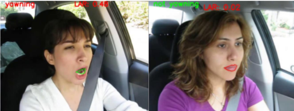

# SomnoGuard: Real-time Drowsiness and Fatigue Detection System for Drivers

SomnoGuard is an advanced deep learning-based system designed to detect drowsiness and fatigue in real-time among drivers. The alarming statistics highlighting the impact of drowsiness and fatigue on road safety have been the driving force behind the development of this algorithm. By alerting drivers at an early stage, we aim to significantly reduce the mortality rate associated with such risks.

## Key Features

- Utilizes Convolutional Neural Networks (CNN) to detect the state of the driver's eyes, indicating drowsiness.
- Implements the Yawning Detection algorithm using the Lip Activity Ratio (LAR) for fatigue detection.
- Provides real-time monitoring and alerts to drivers when signs of drowsiness or fatigue are detected.

## Usage

1. Run the main script to launch the SomnoGuard application.
2. Connect the driver monitoring system to the appropriate sensors and cameras.
3. The system will continuously monitor the driver's eyes and mouth, detect signs of drowsiness and fatigue, and provide real-time alerts.

## Model Architecture

The architecture diagram above provides a detailed view of the layers and components of the CNN used in SomnoGuard.

## Résultats

### Confusion Matrix

The confusion matrix provides insights into the accuracy of the model across different classes.

### Classification Report

The classification report shows precision, recall, and F1-score metrics for each class, providing a comprehensive overview of model performance.

### Resultas

These images illustrate the real-time detection capabilities of SomnoGuard, showing the system actively monitoring and detecting signs of fatigue.

## Roadmap

- Implement the proposed work on an embedded system to reduce computation time and improve real-world utilization.
- Integrate an infrared lighting system that activates only during nighttime for enhanced scene acquisition.
- Incorporate gaze direction analysis to precisely monitor the driver's focus.

## Dataset Description

For the development of the SomnoGuard system, we utilized a specific component of the "Drowsiness Dataset" hosted on Kaggle by Dheeraj Perumandla. This dataset is tailored for the detection of real-time drowsiness in drivers, aligning perfectly with our project’s objectives.

### Data Overview

The dataset includes a collection of eye images categorized into 'open' and 'closed' states, featuring diverse shapes, sizes, and colors. These images form the basis for training our Convolutional Neural Networks (CNN) to detect eye states indicative of drowsiness. Additionally, the dataset includes labels for yawning ('yawn' and 'not yawn').

### Data Utilization

- **Eye Images:** We used these images to train our CNN, benefiting from the wide variety of eye shapes and colors to ensure our model performs reliably across different individuals and under various lighting conditions.
- **Yawning Data:** Although the dataset contains yawning data, we chose not to use this for deep learning. Instead, we applied a simpler and direct measurement method using the Lip Activity Ratio (LAR) to detect signs of yawning. This decision was based on achieving optimal accuracy with less computational demand, which suits our hybrid approach to fatigue detection.

### Data Collection

The dataset's eye images were collected under diverse conditions, ensuring a broad spectrum of data that includes different ethnicities, lighting scenarios, and facial expressions. This diversity is crucial for a model that is effectively generalizable to real-world scenarios, where such factors can significantly influence detection accuracy.

### Contribution to Hybrid Approach

By leveraging a combination of deep learning for eye state detection and a simpler algorithmic approach for yawning detection through the Lip Activity Ratio, our hybrid method not only enhances accuracy but also optimizes computational efficiency. This approach allows SomnoGuard to offer reliable, real-time monitoring and detection of drowsiness and fatigue in drivers.

For more detailed information on the dataset, you can visit the Kaggle dataset page: [Drowsiness Dataset](https://www.kaggle.com/datasets/dheerajperumandla/drowsiness-dataset)

## Presentation

[View the Presentation on Prezi](https://prezi.com/p/mv94z4ipr4om/projet15/?fallback=1)

## Contributors

BADI Oumaima & BELFROUH Sanae

Feel free to contribute to this project by opening issues, submitting pull requests, or suggesting new features.

## License

This project is licensed under the MIT License. See the [LICENSE](LICENSE) file for more details.
